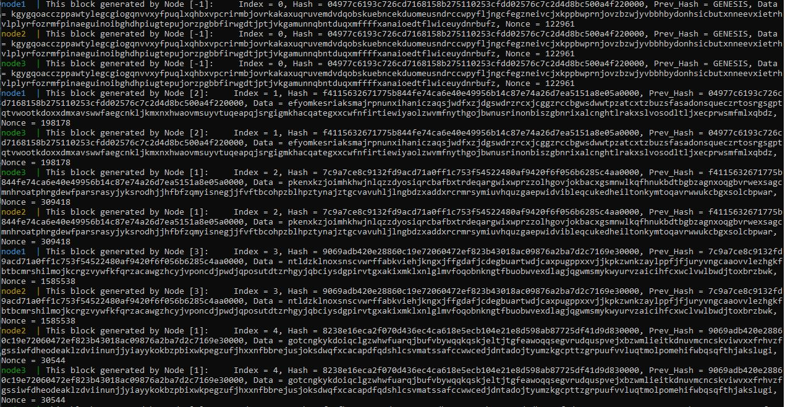

# PythonBlockchain

## Описание
Примитивный Blockchain на Python с использованием веб-серверов, созданных при помощи фреймворка Flask. 

Всего в проекте присутствует три основные сущности:
- **block** - класс для генерации блоков цепочки блокчейна, состоящих из следующих полей:
    - **index** - номер блока по возрастанию, начиная с 0 у `GENESIS`.
    - **hash** - хеш текущего блока, который вычисляется путем конкатенации всех других полей и пересчитывается путем изменения `nonce` до тех пор, пока не будет заканчиваться на `0000`
    - **prev_hash** - хеш предыдущего блока.
    - **data** - некоторые данные, которые являются случайной строчкой из 256 символов.
    - **nonce** - это дополнение, за счет изменения которого можно пересчитывать `hash`.
- **node** - класс текущей node/сервера, который хранит в себе информацию о цепочке блокчейна на данном сервере и содержит функцию для обработки нового блока. В случае добавления при помощи еще одной функции этот блок будет распечатан. 
- **start_node** - класс, за счет которого реализуется взаимодействие между веб-серверами путем отправления друг другу новых блоков, сгенерированных относительно своего последнего блока. Генерация происходит бесконечно после получения блока `GENESIS`.

## Тестирование

[](https://github.com/sergeyfedorov02/PythonBlockchain/actions/workflows/python-app.yml)

## Запуск проекта
Для запуска проекта требуется произвести следующие действия:

1) Осуществить клонирования проекта к себе на устройство при помощи команды 

```git clone https://github.com/sergeyfedorov02/PythonBlockchain.git```

2) Перейти в папку проекта

```cd PythonBlockchain```

3) Осуществить создание образа 

```docker build -t fedorovsa/blockchain:latest .```

4) Запустить Docker Compose

```docker-compose up```

## Демонстрация работы

Демонстрация работы проекта с использованием ```docker-compose```:



Исходя из рисунка видно, что изначально был сгенерирован блок `GENESIS`, который был разослан всем трем нодам и они распечатали этот блок с информацией о том, от кого он пришел. 
Далее видно, что `блок с индексом 1` был сгенерирован на `node2` и был разослан `node1` и `node3`, которые распечатали его содержимое. 
Потом по такому же алгоритму видно, что `блок с индексом 2` был сгенерирован на `node1`, а с `индексом 3 на node3`. 

Если посмотреть на `hash` блоков с одинаковым индексом, то эти значения совпадают и соответствуют условию задачи - последние 4 символа `0000`.
Также видно, что все три `node` имеют одинаковую валидную цепочку, так как `prev_hash` блока совпадает со значением `hash` предыдущего блока (блока с индексом на 1 меньше).
